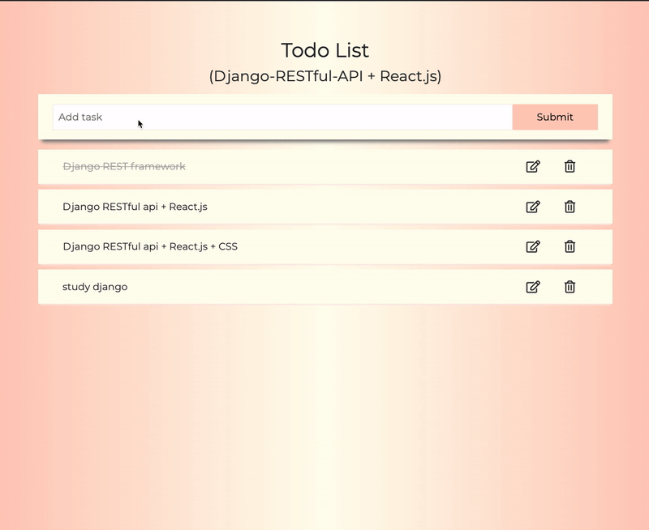

# Todo App Todo App (Django REST framework + React.js)

## Django RESTful API + React.js

> python_Django(RESTful API) + React.js todo app

## Live Demo
Try the application live at [https://jhmyung.pythonanywhere.com/](https://jhmyung.pythonanywhere.com/)

## Technologies Used
- React.js
- Variable CSS
- HTML
- Python
- Django RESTful API

## Features
  - Responsive design
  - User can write todo
  - User can update todo
  - User can delete todo
  - User can check completion of todo

## Preview

